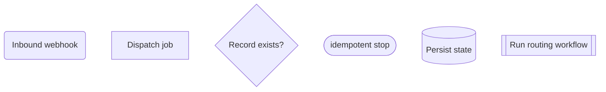

# Mermaid Flowchart Rules

Load this when creating or updating a process documentation flowchart.

## Required Format

- Use Mermaid `flowchart TB`.
- Group nodes into meaningful `subgraph` swimlanes.
- Prefer lanes by domain:
  - models
  - integrations
  - key jobs or decision processes
  - timeline, auth, notifications, or payments where useful

## Entry-point Semantics

All flowchart entries must be strict entry points:

- inbound webhooks
- user/admin actions
- scheduled commands
- queued messages consumed by the app
- API endpoints

Do not chain an expected inbound webhook directly from an outbound API call. If the app calls an external provider and later receives a webhook, show that webhook as a separate entry point and explain the relationship in text.

## Node Rules

- Keep node labels short and verb-led.
- Use decision diamonds for branches.
- Show idempotent stops and error stops explicitly.
- Show outbound integration calls and separate inbound integration callbacks.
- Include terminal outcomes: success, ignore, stop, error.

## Shape Syntax

Use Mermaid v10+ shape syntax where useful:

Recommended meanings:

- Event / webhook: `rounded`
- Process: `rect`
- Multi-step job or workflow: `subproc`
- Decision: `diamond`
- Important database read/write: `cyl`
- Stop/end state: `stadium`
- Prepare/resolve/configure: `hex`

## Validation

Before finishing:

- [ ] The diagram starts from strict entry points.
- [ ] Swimlanes match the actual domains in code.
- [ ] Nodes use real job, event, model, observer, and integration names.
- [ ] Branches match the implementation.
- [ ] The text explains outbound-call-to-later-webhook relationships without drawing them as one deterministic chain.
