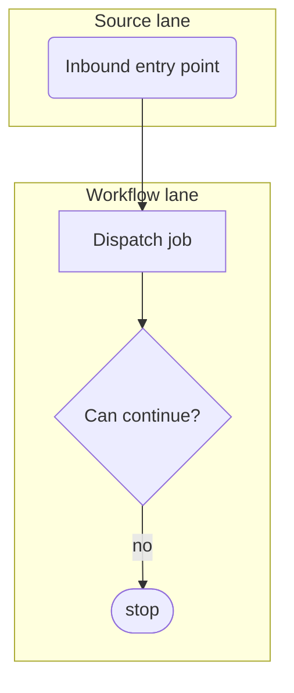

# Process Doc Template

Load this when creating a new process doc or restructuring an existing process doc.

````md
# [Workflow Name]

## Purpose

What this workflow does and when it runs.

## Entry Points

- Strict inbound entry points only: webhooks, UI actions, API endpoints, commands, schedules, queued messages.

## Flowchart



## Key Rules

- State transitions, invariants, idempotency, and important edge cases.

## Data Flow

- How data moves through models, jobs, observers, queues, UI, and integrations.

## Failure Modes

- Retries, ignored states, exceptions, dead ends, and external failures.

## Key Files

- Important implementation files.

## Key Tests

- Tests that prove this workflow.

## Update Triggers

- Changes that require this doc, flowchart, key files/tests, or related docblocks to change.
````

## Template Rules

- Keep sections short and scannable.
- Link to deeper docs or skill references instead of expanding into a long manual.
- Include only information a future agent would likely miss or get wrong.
- Keep "Key files" and "Key tests" aligned with the actual codebase.
